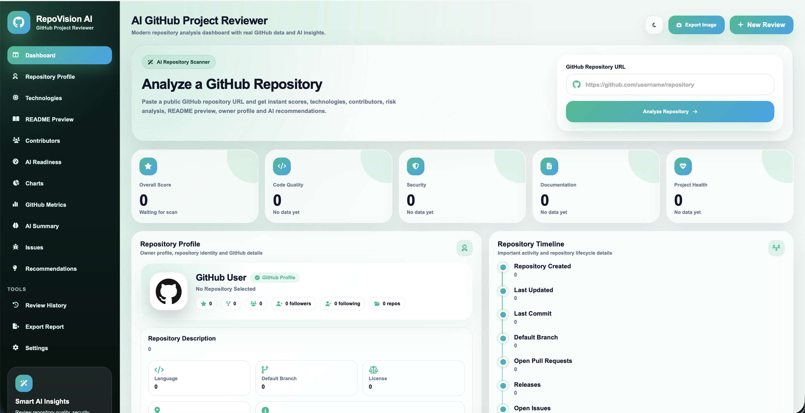
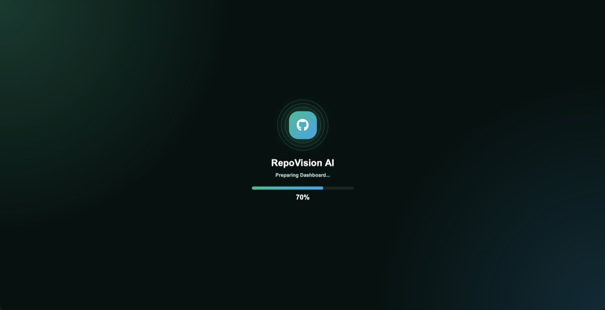
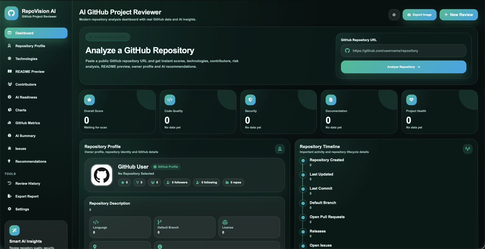
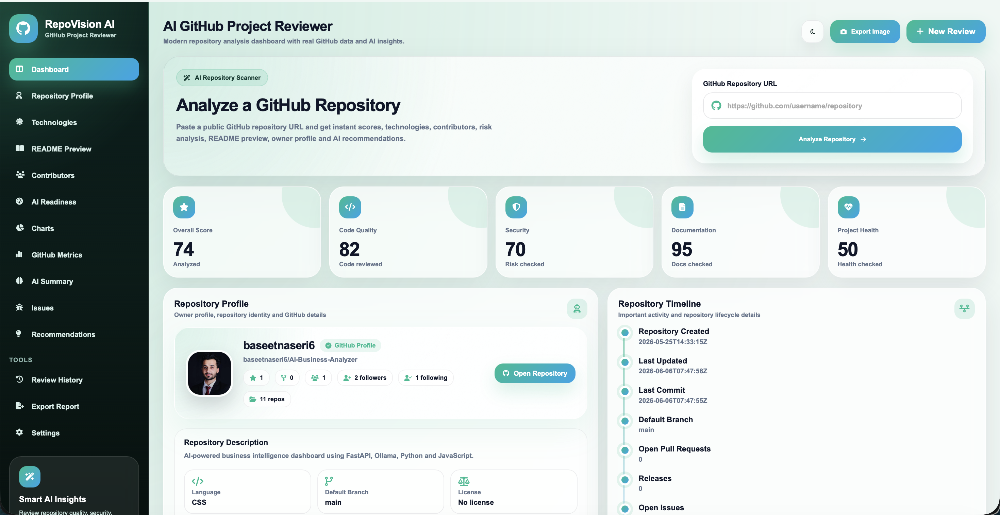
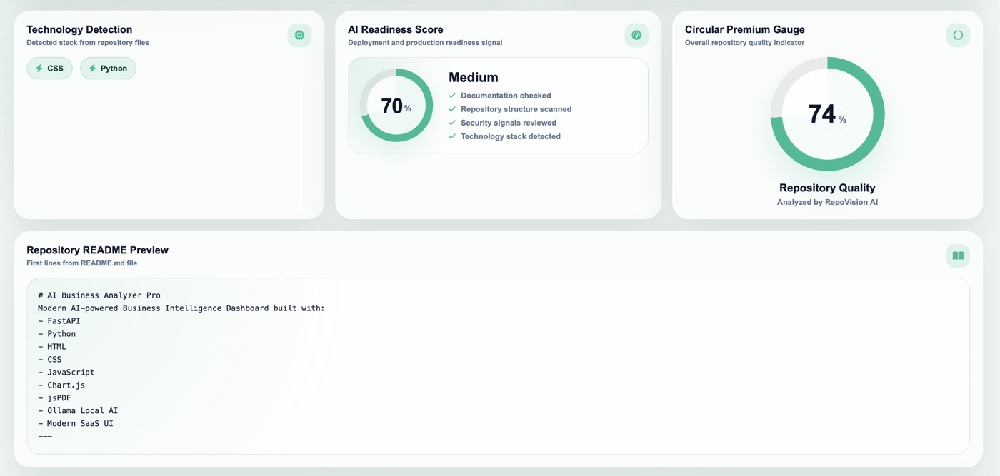
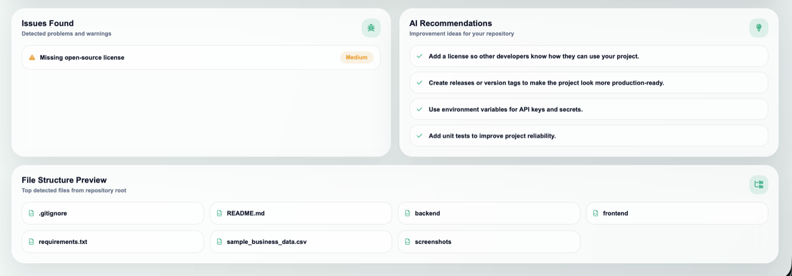
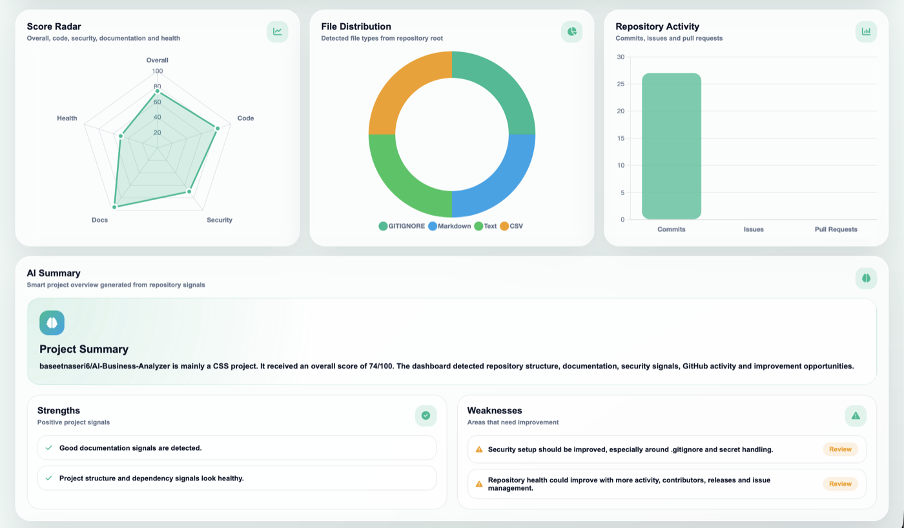
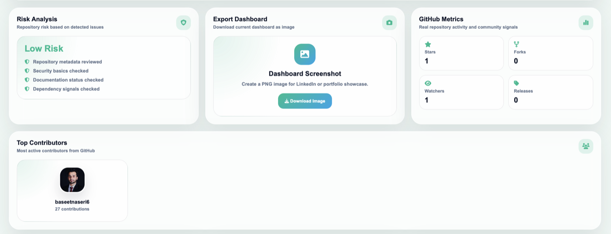

<div align="center">

# RepoVision AI

### AI-Powered GitHub Repository Intelligence Platform

Modern repository analytics, AI insights, security evaluation, code quality scoring, contributor intelligence and advanced GitHub visualization dashboard.

<br>



<br><br>


</div>

---

## Dashboard Preview

### AI Startup Loader



---

### Light Mode


---

### Dark Mode



---

### Repository Analysis



---

### AI Detection Engine



---

### AI Recommendations



---

### Analytics Dashboard



---

### Risk Assessment



---

## Features

### Repository Intelligence

- Repository Health Analysis
- Security Assessment
- Documentation Evaluation
- Code Quality Scoring
- AI Repository Insights
- Contributor Analysis
- Repository Timeline
- README Preview
- Technology Detection

### Analytics

- Radar Score Charts
- Repository Activity Charts
- Language Distribution
- Risk Evaluation
- Readiness Score
- Contributor Statistics

### User Experience

- Premium Glassmorphism Interface
- AI Loader Experience
- Dark Mode
- Light Mode
- Responsive Design
- Dashboard Export
- Animated Statistics

---

## Technology Stack

### Backend

- Python
- Django
- GitHub REST API

### Frontend

- HTML5
- CSS3
- JavaScript
- Chart.js

### UI / UX

- Glassmorphism Design
- Modern Dashboard Architecture
- Responsive Layout
- Premium Animations

---

## Installation

```bash
git clone https://github.com/baseetnaseri6/RepoVision-AI.git
cd RepoVision-AI

python -m venv venv

source venv/bin/activate
# Windows
# venv\Scripts\activate

pip install -r requirements.txt

python manage.py runserver
```

---

## Project Structure

```text
RepoVisionAI
│
├── analyzer
├── templates
├── static
│   ├── css
│   ├── js
│   └── images
│
├── screenshots
│   ├── loader.png
│   ├── light-mode.png
│   ├── dark-mode.png
│   ├── analyze.png
│   ├── ai-detect.png
│   ├── ai-recommendation.png
│   ├── chart.png
│   └── risk.png
│
├── requirements.txt
├── README.md
└── manage.py
```

---

## Author

### Mohammad Baseet Naseri

GitHub: https://github.com/baseetnaseri6

---

## License

MIT License
